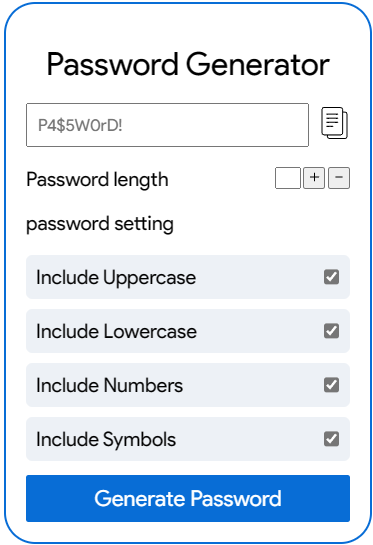

<h1>Project Title: Custom Password Generator</h1>
<h2>Description:</h2>

 The Custom Password Generator is a user-friendly web application that allows users to effortlessly generate secure and customized passwords based on their preferences. With an intuitive user interface built using HTML, CSS, and JavaScript, users can tailor their passwords by selecting specific criteria, including uppercase letters, lowercase letters, numbers, and symbols.

<h2>Key Features:</h2>

<h2>🔩Customization Options:</h2>

Users have the flexibility to choose the types of characters they want in their passwords, providing a fine-grained control over the password's complexity. 

<h2>📋Clipboard Integration:</h2>

Once a password is generated, users can easily copy it to their clipboard with a single click. This streamlined feature enhances usability and ensures a smooth experience for incorporating the generated password into various applications and platforms.

<h2>💻Visual Feedback:</h2>

The interface provides clear visual feedback, guiding users through the customization process and displaying the generated password prominently. This ensures a straightforward and user-friendly experience.

<h2>📱Responsive Design:</h2>

The application is designed to be responsive, adapting seamlessly to various screen sizes and devices, making it accessible and user-friendly across different platforms.

Empower your online security with a password tailored to your preferences. Try the Custom Password Generator now and enhance your digital security effortlessly.

Happy Learning.

<h1>Screenshots</h1>
<table>
<tr>
    <td></td>
</tr>

</table>
<h1>Video Preview</h1>
<table>
<tr>
    <td>
        
    </td>
</tr>

</table>
